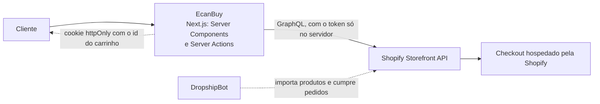
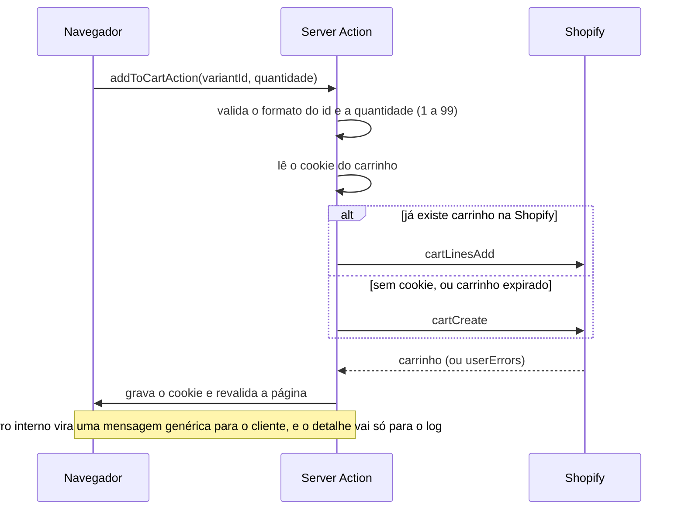

<div align="center">

# EcanBuy

**Loja de dropshipping headless** construída com Next.js (App Router) e Shopify Storefront API, com tema escuro e carrinho, cupom e checkout integrados à Shopify.

[](#)
[](#)
[](#)
[](#)
[](#)
[](https://github.com/MatheusAnsel/Ecanbuy/actions/workflows/ci.yml)
[](#testes-e-ci)

</div>

---

## Sobre o projeto

O EcanBuy é uma loja online de dropshipping. O front end é feito em Next.js e conversa com a Shopify pela Storefront API (modelo headless): catálogo, carrinho, cupons e checkout vêm da Shopify, e os produtos são importados de fornecedores pelo app DropshipBot, que também sincroniza e cumpre os pedidos.



O token da Storefront API nunca chega ao navegador: toda chamada à Shopify acontece no servidor. O carrinho vive na Shopify; o EcanBuy guarda só o id dele em um cookie `httpOnly`. Não há contas de cliente: cadastro, pagamento e pedido ficam no checkout da Shopify.

### Adicionar ao carrinho



Sem as variáveis de ambiente da Shopify, o projeto roda em modo demonstração com um catálogo local, útil para desenvolver a interface.

## Tecnologias

- **Framework:** Next.js 16 (App Router, Server Components e Server Actions)
- **Linguagem:** TypeScript
- **UI:** React 19
- **Estilização:** Tailwind CSS 4, estilos inline e variáveis CSS (tema escuro em `src/app/globals.css`)
- **E-commerce:** Shopify Storefront API (GraphQL)
- **Importação e fulfillment:** DropshipBot (app da Shopify)
- **Package manager:** npm

## Funcionalidades

- [x] **Catálogo** com dados da Shopify (categoria, preço, preço promocional, imagem)
- [x] **Rota dinâmica** de produto por handle (`/produto/[handle]`), com escolha de variante
- [x] **Carrinho** persistido na Shopify (cookie com o id do carrinho), com alteração de quantidade e remoção
- [x] **Cupons de desconto** validados pela Shopify
- [x] **Checkout** hospedado pela Shopify
- [x] **Modo demonstração** com catálogo local quando a Shopify não está configurada
- [x] **Tema escuro** em todo o site, controlado por variáveis CSS
- [x] **Segurança:** validação das entradas das Server Actions, erros genéricos para o cliente, headers de segurança e dependências sem vulnerabilidades conhecidas (`npm audit`)
- [x] **Interface responsiva**

## Como rodar o projeto

```bash
git clone https://github.com/MatheusAnsel/Ecanbuy.git
cd Ecanbuy
npm install
cp .env.example .env.local
npm run dev
```

Abra [http://localhost:3000](http://localhost:3000).

### Conectando à Shopify

1. Crie a loja na Shopify e instale o app DropshipBot para importar produtos.
2. Gere um token de acesso da Storefront API (app personalizado ou canal Headless).
3. Preencha o `.env.local`:

```
SHOPIFY_STORE_DOMAIN=minha-loja.myshopify.com
SHOPIFY_STOREFRONT_TOKEN=seu-token-publico-da-storefront
```

A versão da API pode ser trocada com `SHOPIFY_API_VERSION` (padrão em `src/lib/shopify.ts`). Se a variável ficar em branco, como vem no `.env.example`, vale o padrão.

## Testes e CI

```bash
npm test                # 84 testes (Vitest)
npm run test:coverage   # com cobertura e piso mínimo
npm run lint
npm run typecheck
```

Os testes cobrem a lógica de negócio sem acessar a Shopify de verdade (a `fetch` é simulada):

- **Cliente da Shopify** (`src/lib/shopify.ts`): endpoint, token e versão da API; cache do catálogo (60 s) e carrinho sem cache; mapeamento de produtos (preço promocional só quando o preço de comparação é maior, opções de variante, produto novo nos últimos 30 dias, categoria padrão); mapeamento do carrinho; recusa de `checkoutUrl` que não seja `https`; e transformação de `userErrors` da Shopify em erro.
- **Server Actions** (`src/app/actions.ts`): validação do formato dos ids da Shopify, quantidade de 1 a 99, regras do cupom, cupom recusado removido do carrinho, cookie `httpOnly` e `secure` só em produção, carrinho expirado recriado, e erros internos que não vazam para o cliente.
- **Sessão do carrinho** (`src/lib/cart-session.ts`): leitura do cookie e falha da Shopify sem quebrar a página.
- **Modo demonstração**: sem as variáveis da Shopify, nenhuma requisição é feita.

| Cobertura (out/2026) | Medido | Mínimo exigido no CI |
| --- | --- | --- |
| Linhas e instruções | 100% | 95% |
| Branches | 100% | 90% |
| Funções | 100% | 95% |

A métrica considera `src/lib` e `src/app/actions.ts`, onde está a lógica. As páginas e os componentes são apresentação sobre essa lógica e ficam de fora, assim como `types.ts` e `store-config.ts` (só interfaces e textos). Se a cobertura cair abaixo do mínimo, o CI falha.

O workflow em `.github/workflows/ci.yml` roda a cada push e pull request: auditoria das dependências de produção, lint, verificação de tipos, testes com cobertura e build.

## Estrutura

```
src/
 ├── app/
 │    ├── page.tsx              # Home
 │    ├── produtos/             # Listagem
 │    ├── produto/[handle]/     # Detalhe do produto
 │    ├── carrinho/             # Carrinho
 │    └── actions.ts            # Server Actions do carrinho
 ├── components/                # Componentes de interface
 └── lib/
      ├── shopify.ts            # Cliente da Storefront API (com testes)
      ├── cart-session.ts       # Leitura do carrinho pelo cookie
      ├── mock-products.ts      # Catálogo do modo demonstração
      └── store-config.ts       # Textos de política da loja
```

## Autor

**Matheus Ansel**

- GitHub: [@MatheusAnsel](https://github.com/MatheusAnsel)
- LinkedIn: [linkedin.com/in/matheusansel](https://linkedin.com/in/matheusansel)
- Portfólio: [matheusansel-dev.vercel.app](https://matheusansel-dev.vercel.app)
